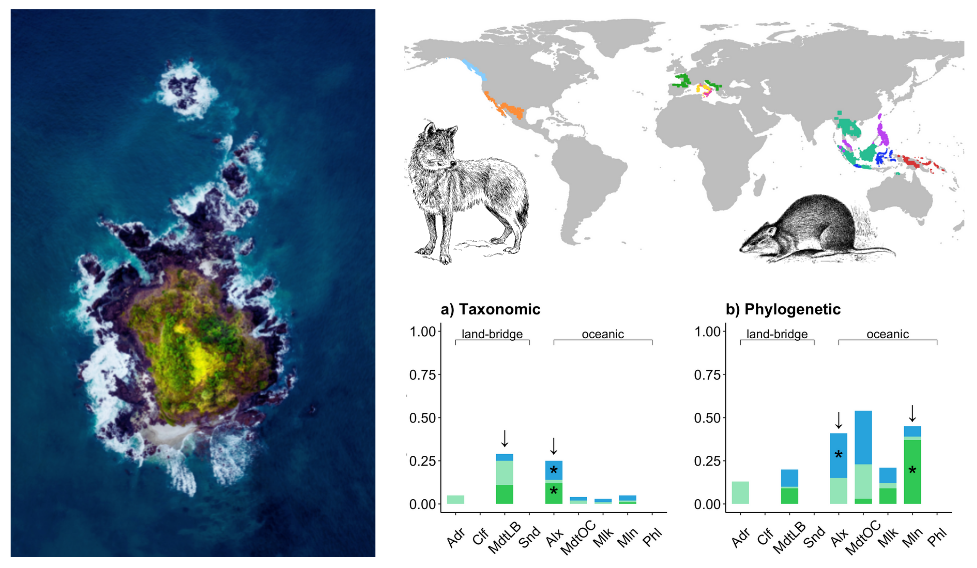

# Source pool diversity and proximity shape the compositional uniqueness of insular mammal assemblages worldwide

Authors: Katherine Hébert, Virginie Millien, Jean-Philippe Lessard  
Journal: Journal of Biogeography  
Published: 21 June 2021  

This repository contains code to replicate figures and some analyses shown in the article and in its supplementary material. 

## Data availability

The insular mammal data on which some of these scripts are based can be accessed here soon:

Hébert, Katherine; Millien, Virginie; Lessard, Jean-Philippe (2022), Source pool diversity and proximity shape the compositional uniqueness of insular mammal assemblages worldwide, Dryad, Dataset, [https://doi.org/10.5061/dryad.rfj6q579r](https://doi.org/10.5061/dryad.rfj6q579r).

## Abstract

Click to read!

1.  **Aim:** Islands have been the test bed of several theories in community ecology, bio-geography, and evolutionary biology. Progress within these disciplines has given a more comprehensive and mechanistic understanding of the processes governing variation in species richness among islands. However, it remains unclear whether these same processes also explain variation in species and phylogenetic composition among islands. Integrating theory from ecology and biogeography, we infer the roles of dispersal, selection, and stochasticity on the composition of insular assemblages within archipelagos. We further assess the influence of source pool diversity and connectivity on the compositional uniqueness of insular assemblages.
2.  **Location:** Island systems worldwide. 
3. **Taxon:** Mammals. 
4. **Methods:** We compiled data on species composition of nonvolant mammals on ~200 islands in nine archipelagos distributed worldwide from the literature. We used variation partitioning to quantify the relative influence of the environment (selection) and geographic distance (dispersal) relative to a null model (stochasticity, randomness) on taxonomic and phylogenetic compositional turnover within archipelagos. We then used a linear mixed model to gain further insight into the underlying mechanisms shaping variation in assemblage composition among islands at a global scale. Specifically, we assessed the influence of source pool diversity, isolation from the source pool, and island characteristics on compositional uniqueness. 
5. **Results:** Our results suggest that within-archipelago variation in the composition of insular mammal assemblages is associated with stochastic or unmeasured processes rather than abiotic selection or dispersal limitation. The diversity and proximity of the source pool, as well as some island characteristics, explained variation in phylogenetic, but not taxonomic, compositional uniqueness globally. Globally, isolated islands associated with phylogenetically diverse source pools exhibit high phylogenetic uniqueness whereas well-connected islands associated with phylogenetically clustered source pools show the opposite trend. Phylogenetically unique assemblages also tend occur on islands with a small elevational span and low annual temperature variation. 
6. **Main conclusions:** Taken together, our results suggest that source pool diversity, along with the potential for colonization from those pools, has a strong influence on the composition of insular mammal assemblages worldwide.

## What the scripts do

### Descriptive plots 

-   `FIG_envPCA.R` and `FIG_env_violin.R` create plots to describe the environmental conditions within and among island systems. The resulting plots are in the Supplementary Material.

### Variation partitioning

-   `FUN_VP.R` is a function used to do variation partitioning, check significance of fractions, and format the outputs into a useful table
-   `FUN_removeVIF.R` is a function that can be used with the `VP` function to remove highly correlated variables according to variance inflation factors 

### Source pools

#### Delineating the source pools

-   `MAKE_regionalpool.R` creates a regional source pool for each island system
-   `MAKE_islandspeciespools.R`creates island-specific source pools
-   `DEMO_dispersionfieldpool.R` is a simplified demonstration of the delineation of an environmentally-filtered assemblage dispersion field for the Alexander Archipelago, shown in Supplementary Material

#### Calculating source pool diversity

-   `PRUNE_phylogenytopools.R` prunes the mammal phylogenetic tree to each per island or regional source pool
-   `CALC_poolsesMPD.R` calculates phylogenetic diversity of the regional and island-specific source pools
-   `CALC_poolrichness_regional.R` assembles taxonomic and phylogenetic diversity of the regional source pool to make `regionalpool_diversity.RDS`
-   `CALC_poolrichness.R` assembles taxonomic and phylogenetic diversity of the island-specific source pools to make `pool_perisland_diversity.RDS`

#### Visualisations

-   `MAP_speciespools.R` maps the regional source pools in Figure 1B (`speciespools_map.png`)
-   `FIG_regionapools_descriptive.R` makes a barplot of regional source pools' diversity (`figs6_pooldiversity.png`)
-   `FIG_perpooldiversity.R` creates a violin plot of island source pools grouped by island system (`perpooldiversity.png` in Supplementary Material)

### Linear mixed models

-   `lmm_fullworkflow_plotfunctions.R` contains several plotting functions to validate the models and visualize their results  
-   `lmm_fullworkflow_prepdata.R` prepares the datasets for the following two scripts
-   `lmm_fullworkflow_tax.R` makes and validates a linear mixed model with taxonomic uniqueness as the response
-   `lmm_fullworkflow_phy.R` makes and validates a linear mixed model with phylogenetic uniqueness as the response
-   `lmm_fullworkflow_fig4combine.R` combines the result plots of the two preceding scripts into Figure 4